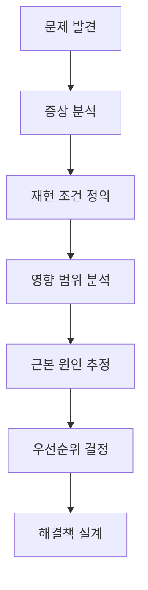
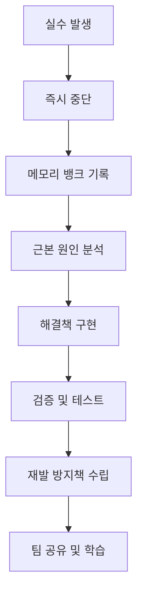

# System Patterns

## 🚨 **체계적 디버깅 패턴 (NEW - MANDATORY)**

### 1. 문제 진단 패턴 (Root Cause Analysis)

#### 구조
```typescript
interface ProblemDiagnosis {
  symptoms: string[];
  reproductionSteps: string[];
  affectedComponents: string[];
  rootCause: string;
  impactScope: 'low' | 'medium' | 'high' | 'critical';
  priority: 'low' | 'medium' | 'high' | 'urgent';
}
```

#### 진단 프로세스


#### 장점
- ✅ **체계적 접근**: 임시 수정 방지
- ✅ **근본 원인 파악**: 재발 방지
- ✅ **영향도 분석**: 전체 시스템 고려
- ✅ **우선순위 설정**: 효율적인 리소스 배분

### 2. 해결책 설계 패턴

#### 설계 체크리스트
```typescript
interface SolutionDesign {
  isTemporary: boolean;
  architecturalConsistency: boolean;
  maintainabilityScore: number; // 1-10
  testability: boolean;
  performanceImpact: 'low' | 'medium' | 'high';
  securityImpact: 'low' | 'medium' | 'high';
}
```

#### 설계 원칙
1. **임시 수정 금지**: 최대 24시간만 허용
2. **아키텍처 일관성**: 기존 패턴과 일치
3. **유지보수성**: 6개월 후에도 이해 가능
4. **테스트 가능성**: 자동화된 테스트 작성
5. **성능 고려**: 성능 저하 없는 해결책

### 3. 실수 해명 패턴 (Error Accountability)

#### 실수 유형별 대응
```typescript
interface ErrorResponse {
  errorType: 'code' | 'architecture' | 'performance' | 'security';
  immediateAction: string;
  rootCauseAnalysis: string;
  preventionMeasures: string[];
  documentationUpdate: string;
}
```

#### 실수 해명 프로세스


#### 책임 원칙
- **모든 실수는 문서화**: 메모리 뱅크에 즉시 기록
- **근본 원인 분석**: 왜 실수가 발생했는지 분석
- **재발 방지책**: 동일한 실수 재발 방지
- **팀 공유**: 실수와 교훈을 팀 전체가 공유

### 4. 코드 품질 관리 패턴

#### 품질 체크리스트
```typescript
interface CodeQualityCheck {
  readability: number; // 1-10
  maintainability: number; // 1-10
  testCoverage: number; // 0-100%
  performanceScore: number; // 1-10
  securityScore: number; // 1-10
}
```

#### 품질 개선 프로세스
1. **정기적 리뷰**: 주간 코드 품질 점검
2. **리팩토링**: 복잡한 코드 단순화
3. **테스트 추가**: 커버리지 향상
4. **문서화**: 복잡한 로직 설명 추가

## 아키텍처 패턴

### 1. Command Pattern (Undo/Redo 시스템)
**목적**: 사용자 작업의 실행/취소/재실행을 위한 표준 패턴

#### 구조
```typescript
interface Command {
  execute(): Promise<void>;
  undo(): Promise<void>;
}

class HistoryManager {
  private commands: Command[] = [];
  private currentIndex = -1;
  
  async executeCommand(command: Command) {
    await command.execute();
    this.commands = this.commands.slice(0, this.currentIndex + 1);
    this.commands.push(command);
    this.currentIndex++;
  }
  
  async undo() {
    if (this.currentIndex >= 0) {
      await this.commands[this.currentIndex].undo();
      this.currentIndex--;
    }
  }
  
  async redo() {
    if (this.currentIndex < this.commands.length - 1) {
      this.currentIndex++;
      await this.commands[this.currentIndex].execute();
    }
  }
}
```

#### 장점
- ✅ **표준 패턴**: 검증된 방법론
- ✅ **확장성**: 새로운 명령어 추가 용이
- ✅ **테스트 용이성**: 각 Command 독립 테스트
- ✅ **에러 처리**: 각 단계별 에러 처리 가능

#### 구현 예시
```typescript
class EditStudentCommand implements Command {
  constructor(
    private studentId: number,
    private oldData: any,
    private newData: any,
    private apiClient: ApiClient
  ) {}
  
  async execute() {
    await this.apiClient.updateStudent(this.studentId, this.newData);
  }
  
  async undo() {
    await this.apiClient.updateStudent(this.studentId, this.oldData);
  }
}
```

### 2. 환경별 전략 패턴

#### 로컬 개발 환경
- **메모리 기반 히스토리**: 빠른 응답
- **즉시 로컬 반영**: 편집 시 즉시 상태 업데이트
- **디버깅 지원**: 콘솔 로그 및 상태 추적

#### 웹 배포 환경
- **하이브리드 방식**: 로컬 캐시 + 서버 동기화
- **데이터 일관성**: 편집 시 즉시 서버 반영
- **에러 복구**: 네트워크 오류 시 자동 롤백

### 3. 상태 관리 패턴

#### Command Stack 관리
```typescript
interface CommandState {
  commands: Command[];
  currentIndex: number;
  canUndo: boolean;
  canRedo: boolean;
}
```

#### 데이터 상태 동기화
```typescript
interface DataState {
  localData: any[];
  serverData: any[];
  isSynchronized: boolean;
  lastSyncTime: Date;
}
```

## 컴포넌트 패턴

### 1. ExcelPreviewTable 컴포넌트
**역할**: 엑셀 미리보기 및 데이터 편집 인터페이스

#### 의존성
- HistoryManager: Undo/Redo 기능
- ApiClient: 서버 통신
- DataGrid: 데이터 표시 및 편집

#### 상태 관리
```typescript
interface ExcelPreviewTableState {
  data: any[];
  loading: boolean;
  error: string | null;
  historyManager: HistoryManager;
  hasUnsavedChanges: boolean;
}
```

### 2. HistoryManager 훅
**역할**: Command Pattern 기반 히스토리 관리

#### 인터페이스
```typescript
interface UseHistoryManager {
  executeCommand: (command: Command) => Promise<void>;
  undo: () => Promise<void>;
  redo: () => Promise<void>;
  canUndo: boolean;
  canRedo: boolean;
  clearHistory: () => void;
}
```

## 데이터 플로우 패턴

### 1. 편집 플로우
```
사용자 편집 → Command 생성 → HistoryManager.executeCommand() → 
서버 API 호출 → 로컬 상태 업데이트 → UI 업데이트
```

### 2. Undo 플로우
```
Undo 버튼 클릭 → HistoryManager.undo() → 
Command.undo() → 서버 API 호출 → 로컬 상태 업데이트 → UI 업데이트
```

### 3. Redo 플로우
```
Redo 버튼 클릭 → HistoryManager.redo() → 
Command.execute() → 서버 API 호출 → 로컬 상태 업데이트 → UI 업데이트
```

## 에러 처리 패턴

### 1. Command 실행 실패
```typescript
try {
  await command.execute();
} catch (error) {
  // 1. 로컬 상태 롤백
  // 2. 사용자에게 에러 알림
  // 3. 히스토리에서 해당 Command 제거
}
```

### 2. 네트워크 오류 복구
```typescript
class NetworkErrorHandler {
  static async retryWithBackoff<T>(
    operation: () => Promise<T>,
    maxRetries: number = 3
  ): Promise<T> {
    for (let i = 0; i < maxRetries; i++) {
      try {
        return await operation();
      } catch (error) {
        if (i === maxRetries - 1) throw error;
        await new Promise(resolve => setTimeout(resolve, Math.pow(2, i) * 1000));
      }
    }
  }
}
```

## 테스트 패턴

### 1. Command 단위 테스트
```typescript
describe('EditStudentCommand', () => {
  it('should execute successfully', async () => {
    const command = new EditStudentCommand(1, oldData, newData, mockApiClient);
    await command.execute();
    expect(mockApiClient.updateStudent).toHaveBeenCalledWith(1, newData);
  });
  
  it('should undo successfully', async () => {
    const command = new EditStudentCommand(1, oldData, newData, mockApiClient);
    await command.undo();
    expect(mockApiClient.updateStudent).toHaveBeenCalledWith(1, oldData);
  });
});
```

### 2. HistoryManager 통합 테스트
```typescript
describe('HistoryManager', () => {
  it('should handle undo/redo correctly', async () => {
    const manager = new HistoryManager();
    const command = new EditStudentCommand(1, oldData, newData, mockApiClient);
    
    await manager.executeCommand(command);
    expect(manager.canUndo()).toBe(true);
    
    await manager.undo();
    expect(manager.canRedo()).toBe(true);
    
    await manager.redo();
    expect(manager.canUndo()).toBe(true);
  });
});
```

## 성능 최적화 패턴

### 1. Command 배치 처리
```typescript
class BatchCommand implements Command {
  constructor(private commands: Command[]) {}
  
  async execute() {
    await Promise.all(this.commands.map(cmd => cmd.execute()));
  }
  
  async undo() {
    await Promise.all(this.commands.map(cmd => cmd.undo()));
  }
}
```

### 2. 메모리 관리
```typescript
class HistoryManager {
  private maxCommands = 100; // 최대 히스토리 개수 제한
  
  private cleanupOldCommands() {
    if (this.commands.length > this.maxCommands) {
      this.commands = this.commands.slice(-this.maxCommands);
      this.currentIndex = Math.min(this.currentIndex, this.commands.length - 1);
    }
  }
}
``` 