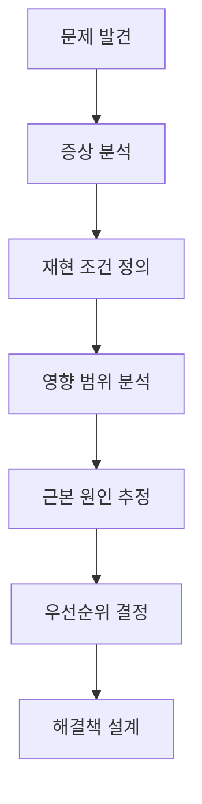
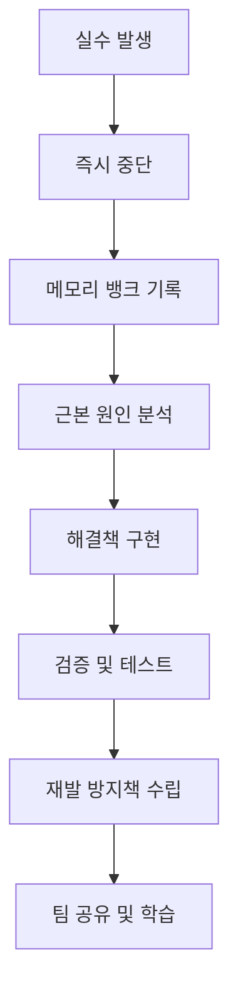
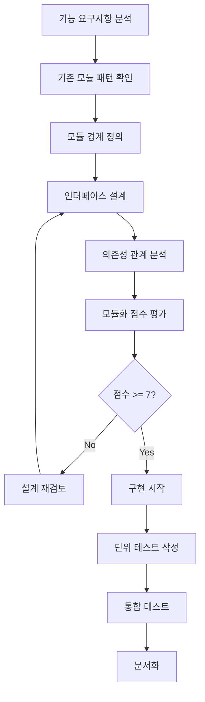
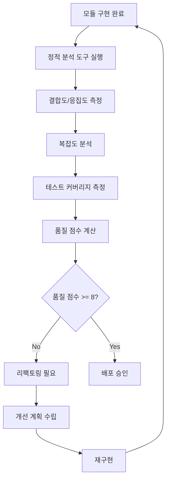

# System Patterns

## 🚨 **체계적 디버깅 패턴 (NEW - MANDATORY)**

### 1. 문제 진단 패턴 (Root Cause Analysis)

#### 구조
```typescript
interface ProblemDiagnosis {
  symptoms: string[];
  reproductionSteps: string[];
  affectedComponents: string[];
  rootCause: string;
  impactScope: 'low' | 'medium' | 'high' | 'critical';
  priority: 'low' | 'medium' | 'high' | 'urgent';
}
```

#### 진단 프로세스


#### 장점
- ✅ **체계적 접근**: 임시 수정 방지
- ✅ **근본 원인 파악**: 재발 방지
- ✅ **영향도 분석**: 전체 시스템 고려
- ✅ **우선순위 설정**: 효율적인 리소스 배분

### 2. 해결책 설계 패턴

#### 설계 체크리스트
```typescript
interface SolutionDesign {
  isTemporary: boolean;
  architecturalConsistency: boolean;
  maintainabilityScore: number; // 1-10
  testability: boolean;
  performanceImpact: 'low' | 'medium' | 'high';
  securityImpact: 'low' | 'medium' | 'high';
}
```

#### 설계 원칙
1. **임시 수정 금지**: 최대 24시간만 허용
2. **아키텍처 일관성**: 기존 패턴과 일치
3. **유지보수성**: 6개월 후에도 이해 가능
4. **테스트 가능성**: 자동화된 테스트 작성
5. **성능 고려**: 성능 저하 없는 해결책

### 3. 실수 해명 패턴 (Error Accountability)

#### 실수 유형별 대응
```typescript
interface ErrorResponse {
  errorType: 'code' | 'architecture' | 'performance' | 'security';
  immediateAction: string;
  rootCauseAnalysis: string;
  preventionMeasures: string[];
  documentationUpdate: string;
}
```

#### 실수 해명 프로세스


#### 책임 원칙
- **모든 실수는 문서화**: 메모리 뱅크에 즉시 기록
- **근본 원인 분석**: 왜 실수가 발생했는지 분석
- **재발 방지책**: 동일한 실수 재발 방지
- **팀 공유**: 실수와 교훈을 팀 전체가 공유

### 4. 코드 품질 관리 패턴

#### 품질 체크리스트
```typescript
interface CodeQualityCheck {
  readability: number; // 1-10
  maintainability: number; // 1-10
  testCoverage: number; // 0-100%
  performanceScore: number; // 1-10
  securityScore: number; // 1-10
}
```

#### 품질 개선 프로세스
1. **정기적 리뷰**: 주간 코드 품질 점검
2. **리팩토링**: 복잡한 코드 단순화
3. **테스트 추가**: 커버리지 향상
4. **문서화**: 복잡한 로직 설명 추가

## 아키텍처 패턴

### 1. Command Pattern (Undo/Redo 시스템)
**목적**: 사용자 작업의 실행/취소/재실행을 위한 표준 패턴

#### 구조
```typescript
interface Command {
  execute(): Promise<void>;
  undo(): Promise<void>;
}

class HistoryManager {
  private commands: Command[] = [];
  private currentIndex = -1;
  
  async executeCommand(command: Command) {
    await command.execute();
    this.commands = this.commands.slice(0, this.currentIndex + 1);
    this.commands.push(command);
    this.currentIndex++;
  }
  
  async undo() {
    if (this.currentIndex >= 0) {
      await this.commands[this.currentIndex].undo();
      this.currentIndex--;
    }
  }
  
  async redo() {
    if (this.currentIndex < this.commands.length - 1) {
      this.currentIndex++;
      await this.commands[this.currentIndex].execute();
    }
  }
}
```

#### 장점
- ✅ **표준 패턴**: 검증된 방법론
- ✅ **확장성**: 새로운 명령어 추가 용이
- ✅ **테스트 용이성**: 각 Command 독립 테스트
- ✅ **에러 처리**: 각 단계별 에러 처리 가능

#### 구현 예시
```typescript
class EditStudentCommand implements Command {
  constructor(
    private studentId: number,
    private oldData: any,
    private newData: any,
    private apiClient: ApiClient
  ) {}
  
  async execute() {
    await this.apiClient.updateStudent(this.studentId, this.newData);
  }
  
  async undo() {
    await this.apiClient.updateStudent(this.studentId, this.oldData);
  }
}
```

### 2. 환경별 전략 패턴

#### 로컬 개발 환경
- **메모리 기반 히스토리**: 빠른 응답
- **즉시 로컬 반영**: 편집 시 즉시 상태 업데이트
- **디버깅 지원**: 콘솔 로그 및 상태 추적

#### 웹 배포 환경
- **하이브리드 방식**: 로컬 캐시 + 서버 동기화
- **데이터 일관성**: 편집 시 즉시 서버 반영
- **에러 복구**: 네트워크 오류 시 자동 롤백

### 3. 상태 관리 패턴

#### Command Stack 관리
```typescript
interface CommandState {
  commands: Command[];
  currentIndex: number;
  canUndo: boolean;
  canRedo: boolean;
}
```

#### 데이터 상태 동기화
```typescript
interface DataState {
  localData: any[];
  serverData: any[];
  isSynchronized: boolean;
  lastSyncTime: Date;
}
```

## 컴포넌트 패턴

### 1. ExcelPreviewTable 컴포넌트
**역할**: 엑셀 미리보기 및 데이터 편집 인터페이스

#### 의존성
- HistoryManager: Undo/Redo 기능
- ApiClient: 서버 통신
- DataGrid: 데이터 표시 및 편집

#### 상태 관리
```typescript
interface ExcelPreviewTableState {
  data: any[];
  loading: boolean;
  error: string | null;
  historyManager: HistoryManager;
  hasUnsavedChanges: boolean;
}
```

### 2. HistoryManager 훅
**역할**: Command Pattern 기반 히스토리 관리

#### 인터페이스
```typescript
interface UseHistoryManager {
  executeCommand: (command: Command) => Promise<void>;
  undo: () => Promise<void>;
  redo: () => Promise<void>;
  canUndo: boolean;
  canRedo: boolean;
  clearHistory: () => void;
}
```

## 데이터 플로우 패턴

### 1. 편집 플로우
```
사용자 편집 → Command 생성 → HistoryManager.executeCommand() → 
서버 API 호출 → 로컬 상태 업데이트 → UI 업데이트
```

### 2. Undo 플로우
```
Undo 버튼 클릭 → HistoryManager.undo() → 
Command.undo() → 서버 API 호출 → 로컬 상태 업데이트 → UI 업데이트
```

### 3. Redo 플로우
```
Redo 버튼 클릭 → HistoryManager.redo() → 
Command.execute() → 서버 API 호출 → 로컬 상태 업데이트 → UI 업데이트
```

## 에러 처리 패턴

### 1. Command 실행 실패
```typescript
try {
  await command.execute();
} catch (error) {
  // 1. 로컬 상태 롤백
  // 2. 사용자에게 에러 알림
  // 3. 히스토리에서 해당 Command 제거
}
```

### 2. 네트워크 오류 복구
```typescript
class NetworkErrorHandler {
  static async retryWithBackoff<T>(
    operation: () => Promise<T>,
    maxRetries: number = 3
  ): Promise<T> {
    for (let i = 0; i < maxRetries; i++) {
      try {
        return await operation();
      } catch (error) {
        if (i === maxRetries - 1) throw error;
        await new Promise(resolve => setTimeout(resolve, Math.pow(2, i) * 1000));
      }
    }
  }
}
```

## 테스트 패턴

### 1. Command 단위 테스트
```typescript
describe('EditStudentCommand', () => {
  it('should execute successfully', async () => {
    const command = new EditStudentCommand(1, oldData, newData, mockApiClient);
    await command.execute();
    expect(mockApiClient.updateStudent).toHaveBeenCalledWith(1, newData);
  });
  
  it('should undo successfully', async () => {
    const command = new EditStudentCommand(1, oldData, newData, mockApiClient);
    await command.undo();
    expect(mockApiClient.updateStudent).toHaveBeenCalledWith(1, oldData);
  });
});
```

### 2. HistoryManager 통합 테스트
```typescript
describe('HistoryManager', () => {
  it('should handle undo/redo correctly', async () => {
    const manager = new HistoryManager();
    const command = new EditStudentCommand(1, oldData, newData, mockApiClient);
    
    await manager.executeCommand(command);
    expect(manager.canUndo()).toBe(true);
    
    await manager.undo();
    expect(manager.canRedo()).toBe(true);
    
    await manager.redo();
    expect(manager.canUndo()).toBe(true);
  });
});
```

## 성능 최적화 패턴

### 1. Command 배치 처리
```typescript
class BatchCommand implements Command {
  constructor(private commands: Command[]) {}
  
  async execute() {
    await Promise.all(this.commands.map(cmd => cmd.execute()));
  }
  
  async undo() {
    await Promise.all(this.commands.map(cmd => cmd.undo()));
  }
}
```

### 2. 메모리 관리
```typescript
class HistoryManager {
  private maxCommands = 100; // 최대 히스토리 개수 제한
  
  private cleanupOldCommands() {
    if (this.commands.length > this.maxCommands) {
      this.commands = this.commands.slice(-this.maxCommands);
      this.currentIndex = Math.min(this.currentIndex, this.commands.length - 1);
    }
  }
}
``` 

## 🏗️ **모듈화 개발 전략 워크플로우 (NEW - MANDATORY)**

### **1. 기능 개발 전 모듈화 설계 패턴**

#### **모듈화 설계 체크리스트**
```typescript
interface ModularDesignCheck {
  // 기본 모듈화 원칙
  singleResponsibility: boolean;        // 단일 책임 원칙
  looseCoupling: boolean;              // 느슨한 결합
  highCohesion: boolean;               // 높은 응집도
  interfaceAbstraction: boolean;       // 인터페이스 추상화
  
  // 확장성 고려사항
  extensibilityScore: number;          // 1-10 확장성 점수
  reusabilityScore: number;            // 1-10 재사용성 점수
  maintainabilityScore: number;        // 1-10 유지보수성 점수
  
  // 기술적 세부사항
  dependencyInjection: boolean;        // 의존성 주입 사용
  factoryPattern: boolean;             // 팩토리 패턴 적용
  adapterPattern: boolean;             // 어댑터 패턴 적용
  strategyPattern: boolean;            // 전략 패턴 적용
  
  // 테스트 및 문서화
  testabilityScore: number;            // 1-10 테스트 가능성
  documentationQuality: number;        // 1-10 문서화 품질
}
```

#### **모듈화 설계 프로세스**


### **2. 모듈화 개발 워크플로우**

#### **Phase 1: 요구사항 분석 및 모듈 설계**
```typescript
interface ModuleRequirementAnalysis {
  // 기능 요구사항
  functionalRequirements: string[];
  nonFunctionalRequirements: string[];
  
  // 기존 시스템 분석
  existingModules: string[];
  potentialConflicts: string[];
  reuseOpportunities: string[];
  
  // 모듈 설계
  moduleName: string;
  modulePurpose: string;
  moduleBoundaries: string[];
  moduleInterfaces: InterfaceDefinition[];
  moduleDependencies: DependencyDefinition[];
}
```

#### **Phase 2: 인터페이스 설계**
```typescript
interface InterfaceDefinition {
  name: string;
  purpose: string;
  methods: MethodDefinition[];
  events: EventDefinition[];
  errorHandling: ErrorStrategy;
  versioning: VersioningStrategy;
}

interface MethodDefinition {
  name: string;
  parameters: ParameterDefinition[];
  returnType: string;
  async: boolean;
  errorHandling: string;
  documentation: string;
}
```

#### **Phase 3: 구현 및 테스트**
```typescript
interface ModuleImplementation {
  // 구현 품질
  codeQuality: CodeQualityMetrics;
  testCoverage: number; // 0-100%
  performanceMetrics: PerformanceMetrics;
  
  // 모듈화 품질
  couplingScore: number; // 1-10 (낮을수록 좋음)
  cohesionScore: number; // 1-10 (높을수록 좋음)
  abstractionLevel: 'low' | 'medium' | 'high';
  
  // 문서화
  apiDocumentation: string;
  usageExamples: string[];
  troubleshootingGuide: string;
}
```

### **3. 모듈화 패턴 라이브러리**

#### **Frontend 모듈화 패턴**
```typescript
// 1. Hook 기반 모듈화
interface HookModule {
  name: string;
  purpose: string;
  dependencies: string[];
  returnType: any;
  sideEffects: string[];
}

// 2. Component 기반 모듈화
interface ComponentModule {
  name: string;
  props: PropDefinition[];
  state: StateDefinition[];
  lifecycle: LifecycleHooks[];
  children: boolean;
}

// 3. Service 기반 모듈화
interface ServiceModule {
  name: string;
  methods: ServiceMethod[];
  state: ServiceState;
  errorHandling: ErrorStrategy;
  caching: CachingStrategy;
}
```

#### **Backend 모듈화 패턴**
```typescript
// 1. Service Layer 모듈화
interface ServiceLayerModule {
  name: string;
  businessLogic: BusinessLogicDefinition[];
  dataAccess: DataAccessLayer;
  validation: ValidationRules;
  errorHandling: ErrorStrategy;
}

// 2. Repository 패턴
interface RepositoryModule {
  entity: string;
  operations: CRUDOperations;
  queryMethods: QueryMethod[];
  caching: CachingStrategy;
  transactionSupport: boolean;
}

// 3. Adapter 패턴
interface AdapterModule {
  sourceSystem: string;
  targetSystem: string;
  transformationRules: TransformationRule[];
  errorMapping: ErrorMapping[];
  performanceOptimization: OptimizationStrategy;
}
```

### **4. 모듈화 품질 평가 시스템**

#### **품질 메트릭스**
```typescript
interface ModularityMetrics {
  // 결합도 (Coupling) - 낮을수록 좋음
  couplingScore: number; // 1-10
  
  // 응집도 (Cohesion) - 높을수록 좋음
  cohesionScore: number; // 1-10
  
  // 복잡도 (Complexity)
  cyclomaticComplexity: number;
  cognitiveComplexity: number;
  
  // 재사용성 (Reusability)
  reuseCount: number;
  dependencyCount: number;
  
  // 테스트 가능성 (Testability)
  testCoverage: number;
  mockDifficulty: number; // 1-10 (낮을수록 좋음)
}
```

#### **품질 평가 프로세스**


### **5. 모듈화 개발 체크리스트**

#### **개발 전 체크리스트**
- [ ] **기존 모듈 패턴 확인**: systemPatterns.md에서 유사한 모듈 패턴 검색
- [ ] **단일 책임 원칙**: 모듈이 하나의 명확한 책임만 가지는지 확인
- [ ] **인터페이스 설계**: 모듈 간 통신을 위한 명확한 인터페이스 정의
- [ ] **의존성 분석**: 모듈 간 의존성 관계 분석 및 최소화
- [ ] **확장성 고려**: 향후 기능 확장을 고려한 설계

#### **구현 중 체크리스트**
- [ ] **코드 분리**: 기능별로 명확한 파일/폴더 구조 분리
- [ ] **의존성 주입**: 하드코딩된 의존성 제거
- [ ] **에러 처리**: 모듈별 적절한 에러 처리 구현
- [ ] **로깅**: 모듈별 디버깅을 위한 로깅 구현
- [ ] **타입 안전성**: TypeScript 타입 정의 완료

#### **테스트 체크리스트**
- [ ] **단위 테스트**: 각 모듈의 독립적인 테스트 작성
- [ ] **통합 테스트**: 모듈 간 상호작용 테스트
- [ ] **모킹 테스트**: 외부 의존성 모킹 테스트
- [ ] **성능 테스트**: 모듈 성능 측정
- [ ] **에러 시나리오**: 에러 상황 테스트

#### **배포 전 체크리스트**
- [ ] **문서화**: API 문서 및 사용법 문서 작성
- [ ] **버전 관리**: 모듈 버전 관리 전략 수립
- [ ] **호환성 검증**: 기존 시스템과의 호환성 확인
- [ ] **성능 검증**: 성능 저하 없는지 확인
- [ ] **보안 검증**: 보안 취약점 없는지 확인

### **6. 모듈화 실패 사례 및 교훈**

#### **실패 패턴 분석**
```typescript
interface ModularizationFailure {
  failureType: 'over-modularization' | 'under-modularization' | 'wrong-abstraction';
  symptoms: string[];
  rootCause: string;
  impact: 'low' | 'medium' | 'high' | 'critical';
  preventionMeasures: string[];
}
```

#### **교훈 및 방지책**
1. **과도한 모듈화 방지**: 너무 작은 모듈로 나누면 복잡성 증가
2. **적절한 추상화 수준**: 너무 추상적이거나 구체적이지 않게 설계
3. **점진적 리팩토링**: 한 번에 모든 것을 모듈화하지 말고 점진적으로 개선
4. **실제 사용 패턴 고려**: 이론적 모듈화보다 실제 사용 패턴 기반 설계 

### **7. 실제 모듈화 적용 예시**

#### **예시 1: 낙관적 업데이트 시스템 모듈화**

##### **기존 문제점**
```typescript
// 기존: 단일 파일에 모든 로직 집중
// useEntityData.ts - 200+ 라인, 여러 책임 혼재
export const useEntityData = (entityType: string) => {
  // 데이터 fetching 로직
  // 낙관적 업데이트 로직
  // 에러 처리 로직
  // 캐시 관리 로직
  // Excel 다운로드 로직
  // ... 200+ 라인
};
```

##### **모듈화 후 구조**
```typescript
// 1. 데이터 fetching 모듈
// hooks/useEntityFetching.ts
export const useEntityFetching = (entityType: string) => {
  // 단일 책임: 데이터 fetching만
};

// 2. 낙관적 업데이트 모듈
// hooks/useOptimisticUpdates.ts
export const useOptimisticUpdates = (entityType: string) => {
  // 단일 책임: 낙관적 업데이트만
};

// 3. 캐시 관리 모듈
// hooks/useEntityCache.ts
export const useEntityCache = (entityType: string) => {
  // 단일 책임: 캐시 관리만
};

// 4. 통합 인터페이스
// hooks/useEntityData.ts
export const useEntityData = (entityType: string) => {
  const fetching = useEntityFetching(entityType);
  const optimistic = useOptimisticUpdates(entityType);
  const cache = useEntityCache(entityType);
  
  return {
    ...fetching,
    ...optimistic,
    ...cache
  };
};
```

##### **모듈화 품질 평가**
```typescript
const modularityScore = {
  singleResponsibility: true,    // ✅ 각 모듈이 단일 책임
  looseCoupling: true,          // ✅ 모듈 간 느슨한 결합
  highCohesion: true,           // ✅ 관련 기능이 함께 응집
  interfaceAbstraction: true,   // ✅ 명확한 인터페이스
  extensibilityScore: 9,        // ✅ 쉽게 확장 가능
  reusabilityScore: 8,          // ✅ 다른 곳에서 재사용 가능
  maintainabilityScore: 9,      // ✅ 유지보수 용이
  testabilityScore: 9,          // ✅ 각 모듈 독립적 테스트 가능
  overallScore: 8.5             // ✅ 8점 이상 - 배포 승인
};
```

#### **예시 2: AI 서비스 모듈화**

##### **기존 문제점**
```python
# 기존: 단일 파일에 모든 AI 로직
# ai_service.py - 300+ 라인, 여러 AI 서비스 혼재
class AIService:
    def __init__(self):
        self.openai_client = OpenAI()
        self.gemini_client = Gemini()
        # ... 복잡한 초기화
    
    def process_chat(self, message):
        # OpenAI 로직
        # Gemini 로직
        # 에러 처리 로직
        # 응답 검증 로직
        # ... 300+ 라인
```

##### **모듈화 후 구조**
```python
# 1. AI 어댑터 인터페이스
# ai/adapters/base_adapter.py
class BaseAIAdapter(ABC):
    @abstractmethod
    def process_chat(self, message: str) -> str:
        pass

# 2. OpenAI 어댑터
# ai/adapters/openai_adapter.py
class OpenAIAdapter(BaseAIAdapter):
    def process_chat(self, message: str) -> str:
        # 단일 책임: OpenAI만 처리

# 3. Gemini 어댑터
# ai/adapters/gemini_adapter.py
class GeminiAdapter(BaseAIAdapter):
    def process_chat(self, message: str) -> str:
        # 단일 책임: Gemini만 처리

# 4. 팩토리 패턴
# ai/adapters/adapter_factory.py
class AIAdapterFactory:
    @staticmethod
    def create_adapter(provider: str) -> BaseAIAdapter:
        # 단일 책임: 어댑터 생성만

# 5. 통합 서비스
# ai/services/unified_ai_service.py
class UnifiedAIService:
    def __init__(self, factory: AIAdapterFactory):
        self.factory = factory
    
    def process_chat(self, message: str, provider: str = "openai") -> str:
        adapter = self.factory.create_adapter(provider)
        return adapter.process_chat(message)
```

##### **모듈화 품질 평가**
```python
modularity_metrics = {
    "coupling_score": 2,        # 낮은 결합도 (1-10, 낮을수록 좋음)
    "cohesion_score": 9,        # 높은 응집도 (1-10, 높을수록 좋음)
    "complexity": 3,            # 낮은 복잡도
    "testability": 9,           # 높은 테스트 가능성
    "reusability": 8,           # 높은 재사용성
    "maintainability": 9,       # 높은 유지보수성
    "overall_score": 8.3        # 8점 이상 - 배포 승인
}
```

#### **예시 3: Excel 다운로드 모듈화**

##### **기존 문제점**
```typescript
// 기존: 단일 컴포넌트에 모든 로직
// ExcelDownloadButton.tsx - 150+ 라인
export const ExcelDownloadButton = ({ data, columns }) => {
  // 데이터 검증 로직
  // Excel 생성 로직
  // 다운로드 로직
  // 상태 관리 로직
  // 에러 처리 로직
  // ... 150+ 라인
};
```

##### **모듈화 후 구조**
```typescript
// 1. 데이터 검증 모듈
// utils/excelDataValidator.ts
export const validateExcelData = (data: any[], columns: any[]) => {
  // 단일 책임: 데이터 검증만
};

// 2. Excel 생성 모듈
// utils/excelGenerator.ts
export const generateExcelFile = (data: any[], columns: any[]) => {
  // 단일 책임: Excel 파일 생성만
};

// 3. 다운로드 모듈
// utils/fileDownloader.ts
export const downloadFile = (blob: Blob, filename: string) => {
  // 단일 책임: 파일 다운로드만
};

// 4. 상태 관리 모듈
// hooks/useDownloadState.ts
export const useDownloadState = () => {
  // 단일 책임: 다운로드 상태 관리만
};

// 5. 통합 컴포넌트
// components/ExcelDownloadButton.tsx
export const ExcelDownloadButton = ({ data, columns }) => {
  const { state, actions } = useDownloadState();
  
  const handleDownload = async () => {
    const validData = validateExcelData(data, columns);
    const excelBlob = generateExcelFile(validData, columns);
    await downloadFile(excelBlob, `data_${Date.now()}.xlsx`);
  };
  
  return <Button onClick={handleDownload}>다운로드</Button>;
};
```

### **8. 모듈화 성공 지표**

#### **정량적 지표**
- **코드 라인 수**: 모듈당 50-100라인 이하
- **순환 복잡도**: 모듈당 10 이하
- **테스트 커버리지**: 90% 이상
- **의존성 수**: 모듈당 3개 이하
- **재사용 횟수**: 모듈당 2회 이상

#### **정성적 지표**
- **가독성**: 새로운 개발자가 10분 내 이해 가능
- **유지보수성**: 버그 수정 시 다른 모듈 영향 없음
- **확장성**: 새 기능 추가 시 기존 모듈 수정 불필요
- **테스트 용이성**: 모킹 없이 독립적 테스트 가능 