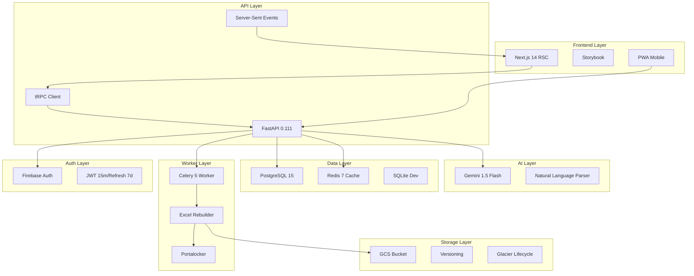

# Academy AI Assistant - 시스템 아키텍처 패턴

## 전체 시스템 아키텍처



## 핵심 설계 패턴

### 1. AI-First Architecture
```
[User Input] → [Natural Language] → [Gemini Parser] → [CRUD Operations] → [Database]
     ↓              ↓                    ↓                    ↓              ↓
[SSE Stream] ← [Real-time Feedback] ← [Processing Status] ← [Validation] ← [Results]
```

### 2. Excel Rebuilder Pattern
```
[Data Change] → [Celery Task] → [Portalocker Lock] → [openpyxl.write_only] → [Atomic Rename] → [GCS Upload]
     ↓              ↓                ↓                    ↓                    ↓              ↓
[Version N+1] ← [Task Complete] ← [Lock Release] ← [File Generated] ← [Temp File] ← [Versioned Upload]
```

### 3. Real-time Communication
```
[FastAPI] → [SSE Stream] → [Next.js] → [UI Update]
     ↓           ↓            ↓           ↓
[Gemini] → [Processing] → [tRPC] → [State Sync]
```

## 데이터 플로우 패턴

### 자연어 명령 처리 플로우
1. **사용자 입력**: Next.js에서 자연어 명령 입력
2. **tRPC 호출**: FastAPI `/command` 엔드포인트로 전송
3. **Gemini 파싱**: 자연어를 구조화된 JSON으로 변환
4. **검증**: Pydantic을 통한 데이터 검증
5. **데이터베이스 작업**: SQLModel ORM을 통한 CRUD
6. **Excel Rebuilder**: Celery 태스크로 Excel 파일 재생성
7. **실시간 피드백**: SSE를 통한 처리 상태 스트리밍

### 파일 관리 플로우
1. **업로드**: presigned URL을 통한 직접 GCS 업로드
2. **메타데이터 저장**: PostgreSQL에 파일 정보 저장
3. **미리보기**: SheetJS → Handsontable 100행 청크 처리
4. **다운로드**: presigned URL을 통한 직접 다운로드
5. **버전 관리**: GCS 버전 관리 및 Glacier 아카이빙

## 보안 패턴

### 인증 및 권한
- **Firebase Auth**: Google Sign-In 기반 인증
- **JWT 토큰**: 15분 액세스 + 7일 리프레시
- **Role-based ACL**: 학생/강사/관리자 권한 분리
- **Row-level Lock**: PostgreSQL 행 수준 잠금

### 데이터 보안
- **TLS 암호화**: 모든 전송 데이터 암호화
- **GCS 버전 관리**: 파일 변경 이력 추적
- **PITR**: PostgreSQL Point-in-Time Recovery
- **Redis 블랙리스트**: 만료된 JWT 토큰 관리

## 성능 패턴

### 캐싱 전략
- **Redis LRU**: 256MB 메모리 캐시
- **JWT 캐싱**: 토큰 검증 결과 캐싱
- **파일 메타데이터**: 자주 접근하는 파일 정보 캐싱

### 비동기 처리
- **Celery Worker**: Excel 재생성 비동기 처리
- **SSE 스트리밍**: 실시간 상태 업데이트
- **Background Tasks**: FastAPI 백그라운드 태스크

### 데이터베이스 최적화
- **SQLModel ORM**: 타입 안전한 데이터베이스 접근
- **Connection Pooling**: 데이터베이스 연결 풀 관리
- **Indexing**: 자주 조회되는 컬럼 인덱싱

## 확장성 패턴

### 마이크로서비스 준비
- **API Gateway**: FastAPI를 통한 단일 진입점
- **Service Discovery**: 내부 서비스 간 통신
- **Load Balancing**: Cloud Run을 통한 자동 스케일링

### 모니터링 및 로깅
- **Sentry**: 에러 추적 및 성능 모니터링
- **Grafana**: 메트릭 시각화 및 알림
- **Cloud Logging**: 중앙화된 로그 관리

## 개발 패턴

### 코드 구조
```
backend/
├── app/
│   ├── api/          # FastAPI 라우터
│   ├── core/         # 설정 및 유틸리티
│   ├── models/       # SQLModel 모델
│   ├── services/     # 비즈니스 로직
│   └── workers/      # Celery 태스크
├── tests/            # pytest 테스트
└── alembic/          # 데이터베이스 마이그레이션

frontend/
├── app/              # Next.js App Router
├── components/       # 재사용 가능한 컴포넌트
├── lib/              # 유틸리티 함수
├── hooks/            # 커스텀 훅
└── stories/          # Storybook 스토리
```

### 테스트 전략
- **Unit Tests**: pytest를 통한 단위 테스트
- **Integration Tests**: API 엔드포인트 통합 테스트
- **E2E Tests**: Playwright를 통한 전체 플로우 테스트
- **AI Tests**: Gemini 응답 품질 테스트 