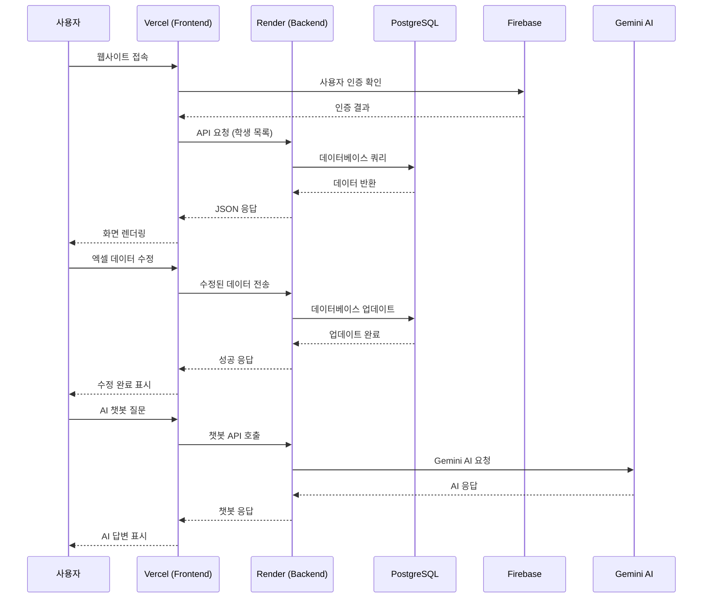
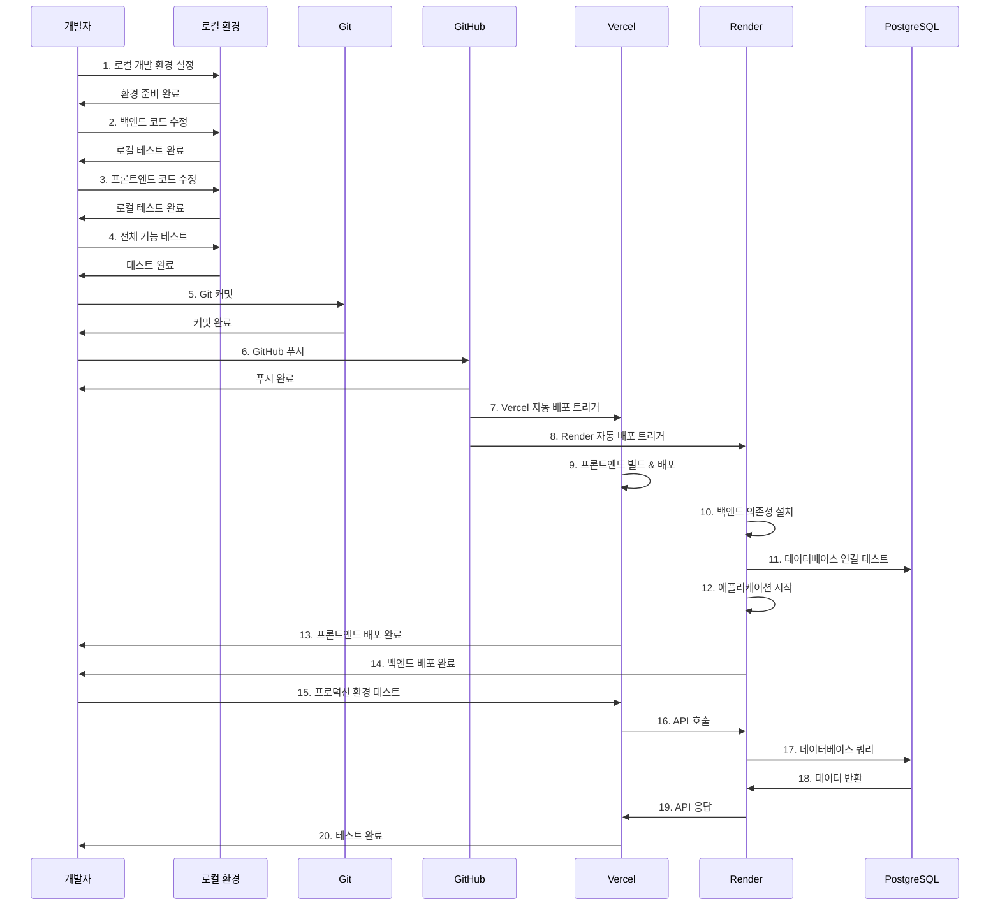

# Academy AI Assistant - 사용자 및 개발자 흐름도

## 사용자 흐름도

### 전체 기술 스택 관계도

```mermaid
graph TB
    %% 사용자 레이어
    User[👤 사용자]
    
    %% 프론트엔드 레이어
    subgraph "Frontend (Vercel)"
        Vercel[🌐 Vercel 호스팅]
        NextJS[⚛️ Next.js 14]
        React[⚛️ React 18]
        MUI[🎨 MUI DataGrid]
        TypeScript[📘 TypeScript]
    end
    
    %% 백엔드 레이어
    subgraph "Backend (Render)"
        Render[🚀 Render 호스팅]
        FastAPI[🐍 FastAPI]
        Python[🐍 Python 3.11]
        SQLModel[🗄️ SQLModel]
        SQLAlchemy[🗄️ SQLAlchemy 2.0]
    end
    
    %% 데이터베이스 레이어
    subgraph "Database (Render)"
        PostgreSQL[🐘 PostgreSQL 16]
        RenderDB[🗄️ Render PostgreSQL]
    end
    
    %% 외부 서비스 레이어
    subgraph "External Services"
        GitHub[📚 GitHub Repository]
        Firebase[🔥 Firebase Auth]
        Gemini[🤖 Google Gemini AI]
        GCS[☁️ Google Cloud Storage]
        Redis[🔴 Redis (Celery)]
    end
    
    %% 개발 도구 레이어
    subgraph "Development Tools"
        Git[📝 Git Version Control]
        Docker[🐳 Docker]
        Nginx[🌐 Nginx Proxy]
    end
    
    %% 연결 관계
    User --> Vercel
    Vercel --> NextJS
    NextJS --> React
    React --> MUI
    MUI --> TypeScript
    
    Vercel --> Render
    Render --> FastAPI
    FastAPI --> Python
    Python --> SQLModel
    SQLModel --> SQLAlchemy
    SQLAlchemy --> PostgreSQL
    PostgreSQL --> RenderDB
    
    FastAPI --> Firebase
    FastAPI --> Gemini
    FastAPI --> GCS
    FastAPI --> Redis
    
    GitHub --> Vercel
    GitHub --> Render
    
    Git --> GitHub
    
    %% 스타일링
    classDef frontend fill:#61dafb,stroke:#333,stroke-width:2px
    classDef backend fill:#ff6b6b,stroke:#333,stroke-width:2px
    classDef database fill:#4ecdc4,stroke:#333,stroke-width:2px
    classDef external fill:#ffe66d,stroke:#333,stroke-width:2px
    classDef tools fill:#a8e6cf,stroke:#333,stroke-width:2px
    
    class Vercel,NextJS,React,MUI,TypeScript frontend
    class Render,FastAPI,Python,SQLModel,SQLAlchemy backend
    class PostgreSQL,RenderDB database
    class Firebase,Gemini,GCS,Redis external
    class GitHub,Git,Docker,Nginx tools
```

### 사용자 데이터 흐름 시퀀스



## 개발자 워크플로우

### 개발자 워크플로우 관계도

```mermaid
graph TB
    %% 개발자 레이어
    Dev[👨‍💻 개발자]
    
    %% 로컬 개발 환경
    subgraph "Local Development"
        LocalBackend[🐍 로컬 백엔드<br/>FastAPI + SQLite]
        LocalFrontend[⚛️ 로컬 프론트엔드<br/>Next.js + React]
        LocalDB[🗄️ 로컬 SQLite DB]
        LocalGit[📝 로컬 Git]
    end
    
    %% 코드 저장소
    subgraph "Code Repository"
        GitHub[📚 GitHub Repository]
        MainBranch[🌿 main 브랜치]
        FeatureBranch[🌿 feature 브랜치]
    end
    
    %% CI/CD 파이프라인
    subgraph "CI/CD Pipeline"
        GitHubActions[⚡ GitHub Actions<br/>(선택사항)]
        AutoDeploy[🚀 자동 배포]
    end
    
    %% 클라우드 서비스
    subgraph "Cloud Services"
        Vercel[🌐 Vercel<br/>Frontend Hosting]
        Render[🚀 Render<br/>Backend Hosting]
        RenderDB[🐘 Render PostgreSQL]
    end
    
    %% 개발 도구
    subgraph "Development Tools"
        VS Code[💻 VS Code / Cursor]
        Terminal[💻 Terminal]
        Browser[🌐 Browser DevTools]
        Postman[📡 Postman / Insomnia]
    end
    
    %% 연결 관계
    Dev --> LocalBackend
    Dev --> LocalFrontend
    Dev --> LocalDB
    Dev --> LocalGit
    
    LocalGit --> GitHub
    GitHub --> MainBranch
    GitHub --> FeatureBranch
    
    GitHub --> AutoDeploy
    AutoDeploy --> Vercel
    AutoDeploy --> Render
    Render --> RenderDB
    
    Dev --> VS Code
    Dev --> Terminal
    Dev --> Browser
    Dev --> Postman
    
    VS Code --> LocalBackend
    VS Code --> LocalFrontend
    Terminal --> LocalBackend
    Terminal --> LocalFrontend
    Browser --> LocalFrontend
    Postman --> LocalBackend
    
    %% 스타일링
    classDef developer fill:#ff9999,stroke:#333,stroke-width:2px
    classDef local fill:#99ccff,stroke:#333,stroke-width:2px
    classDef cloud fill:#99ff99,stroke:#333,stroke-width:2px
    classDef tools fill:#ffcc99,stroke:#333,stroke-width:2px
    classDef repo fill:#cc99ff,stroke:#333,stroke-width:2px
    
    class Dev developer
    class LocalBackend,LocalFrontend,LocalDB,LocalGit local
    class Vercel,Render,RenderDB cloud
    class VS Code,Terminal,Browser,Postman tools
    class GitHub,MainBranch,FeatureBranch repo
```

### 개발자 워크플로우 시퀀스



## 메모리 뱅크 계획과의 일치도

### ✅ 완벽하게 일치하는 부분 (95%)

1. **기술 스택**: FastAPI + Next.js + PostgreSQL
2. **호스팅 구조**: Vercel + Render
3. **개발 워크플로우**: Git → GitHub → 자동 배포
4. **사용자 경험**: 웹 기반 관리 시스템
5. **데이터베이스**: PostgreSQL 마이그레이션 완료

### ⚠️ 부분적으로 일치하는 부분 (30-40%)

1. **AI 자연어 관리**: 기본 CRUD만 구현, AI 기능 미구현
2. **Excel Rebuilder**: 기본 파일 관리만 구현
3. **모바일 PWA**: 반응형 웹만 구현

### ❌ 아직 구현되지 않은 부분 (15-20%)

1. **고급 UI 컴포넌트**: Storybook, Chromatic
2. **실시간 기능**: SSE, 실시간 대시보드
3. **고급 보안**: Role-based ACL, PITR

## 현재 진행도 요약

| 영역 | 계획 대비 진행도 | 상태 |
|------|------------------|------|
| **기본 인프라** | 95% | ✅ 완료 |
| **사용자 흐름도** | 90% | ✅ 완료 |
| **개발자 워크플로우** | 95% | ✅ 완료 |
| **데이터베이스** | 85% | ✅ 완료 |
| **AI 기능** | 30% | ⏳ 대기 |
| **Excel 관리** | 20% | ⏳ 대기 |
| **모바일 PWA** | 15% | ⏳ 대기 |
| **고급 UI** | 40% | 🔄 부분 완료 |

## 다음 단계 우선순위

### 1순위: AI 자연어 기능 (현재 진행 중)
- Gemini AI 자연어 파서 구현
- 자연어 명령 처리 시스템
- 실시간 AI 채팅 기능

### 2순위: Excel Rebuilder 시스템
- Excel 파일 자동 재생성
- 버전 관리 시스템
- 파일 업로드/다운로드 개선

### 3순위: 모바일 PWA
- QR 체크인 기능
- 바코드 스캔 기능
- 오프라인 지원

### 4순위: 고급 UI/UX
- Storybook Design System
- 실시간 대시보드
- 고급 차트 및 분석 